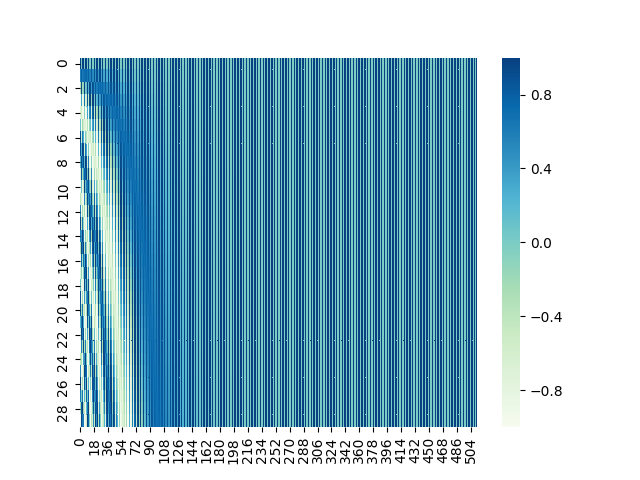
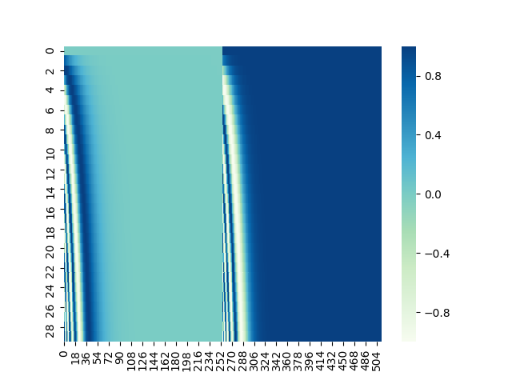

Positional Encoding Visualization
===

This repository is for visualizing positional encoding used in [Transformer](https://arxiv.org/abs/1706.03762) with Seaborn and Matplotlib.

## Requirements
Matplotlib
Seaborn
NumPy

## How to Run
1. Clone and move this repository.
    ```
    git clone https://github.com/gucci-j/pe-visualization.git
    cd pe-visualization
    ```

2. Run `main.py` with arguments.  
    * Arguments
    1. `position` : length of input tokens
    2. `i` : dimension of word embeddings
    3. `d_model` : dimension of the Transformer model (hidden layer)  

    * Example
    ```
    python main.py 30 512 512
    ```

    In this case, `position` is 30, `i` is 512 and `d_model` is 512, respectively.

## Result
This is the same encoding mechanism as the original paper.   



This is the same encoding mechanism as [this blog post](https://jalammar.github.io/illustrated-transformer/).  

